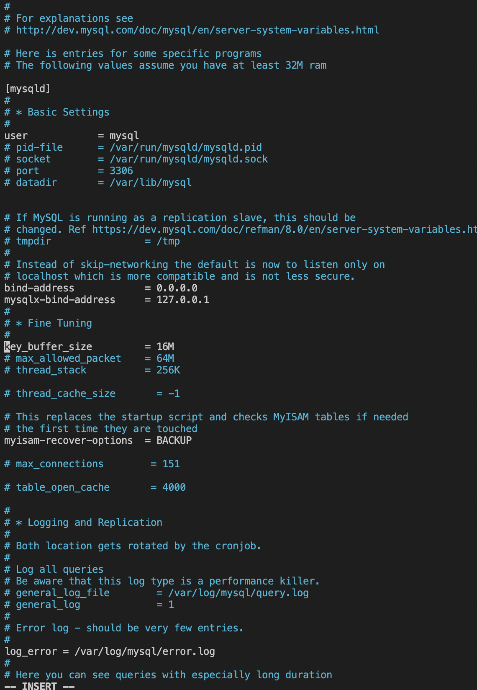

## awesome documentation of project 5-client /server implemention

`sudo apt update -y`

`sudo apt install mysql-server -y`

`sudo systemctl enable mysql`

`sudo mysql`

`ALTER USER 'root'@'localhost' IDENTIFIED WITH mysql_native_password BY 'PassWord.1'`

`sudo mysql_secure_instalation`

`sudo mysql -p`

`CREATE USER 'remote_user'@'%' IDENTIFIED WITH mysql_native_password BY 'password';`

`CREATE DATABASE dupe_db;`

`GRANT ALL ON dupe_db.* TO 'remote_user'@'%' WITH GRANT OPTION;`
`FLUSH PRIVILAGES`

`sudo vi /etc/mysql/mysql.conf.d/mysqld.cnf`

`sudo systemctl restart mysql`

